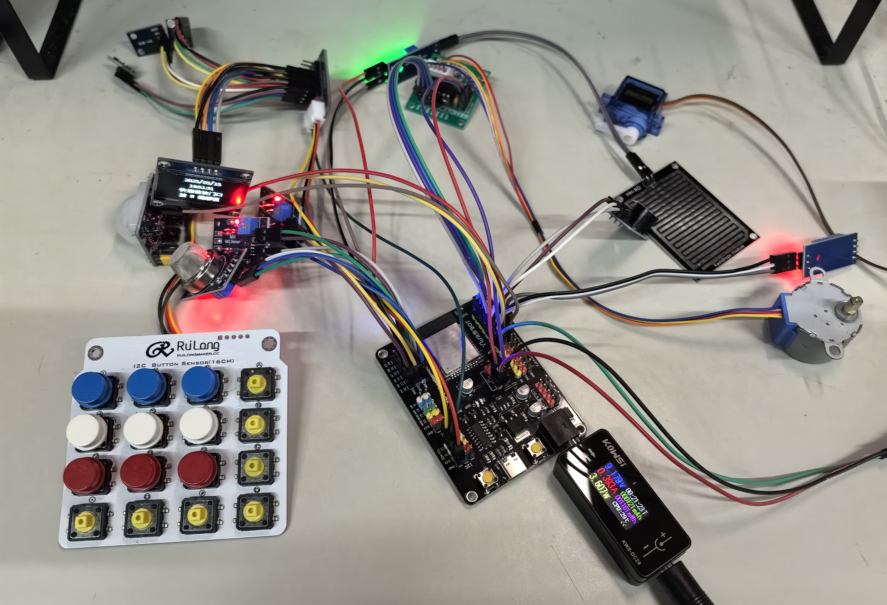
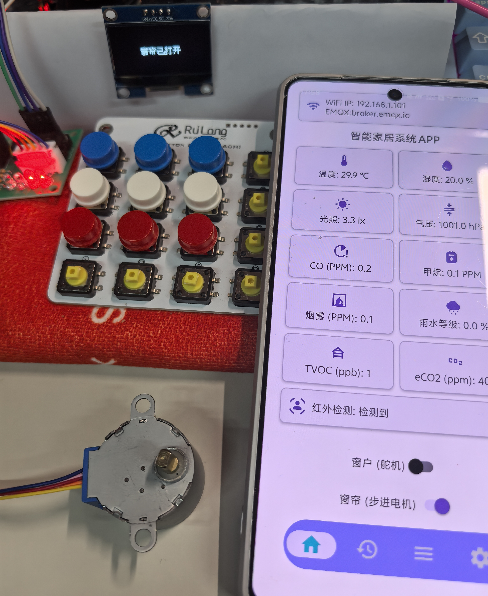
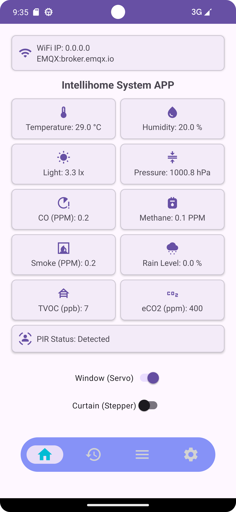
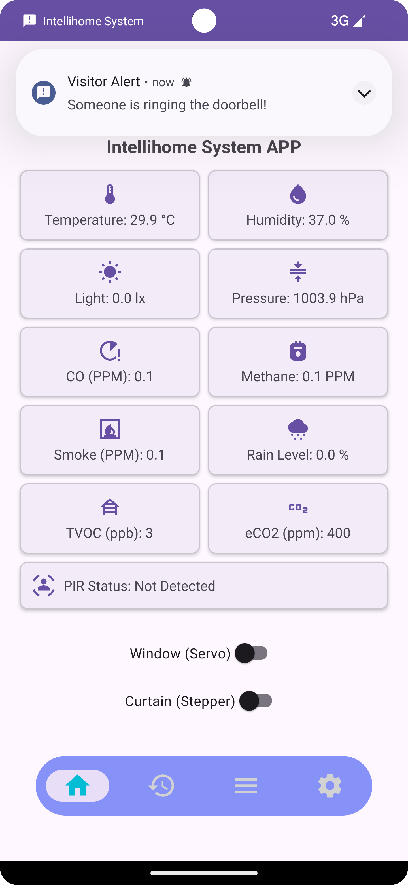
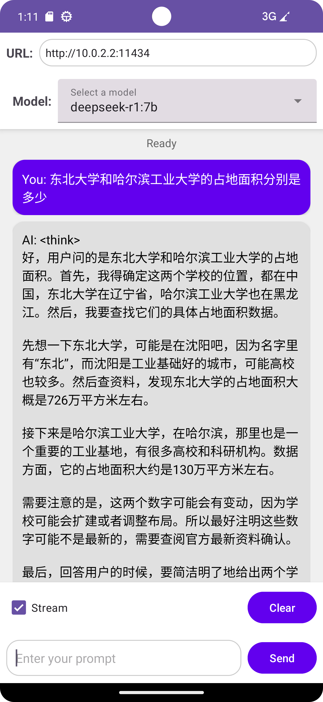
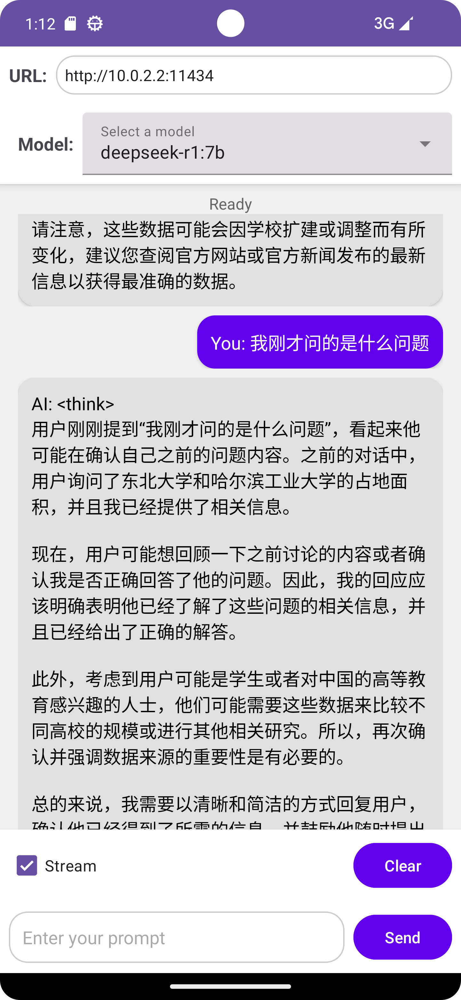
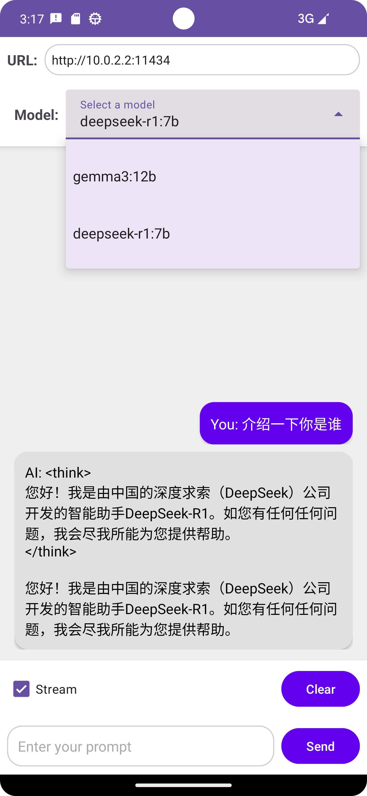
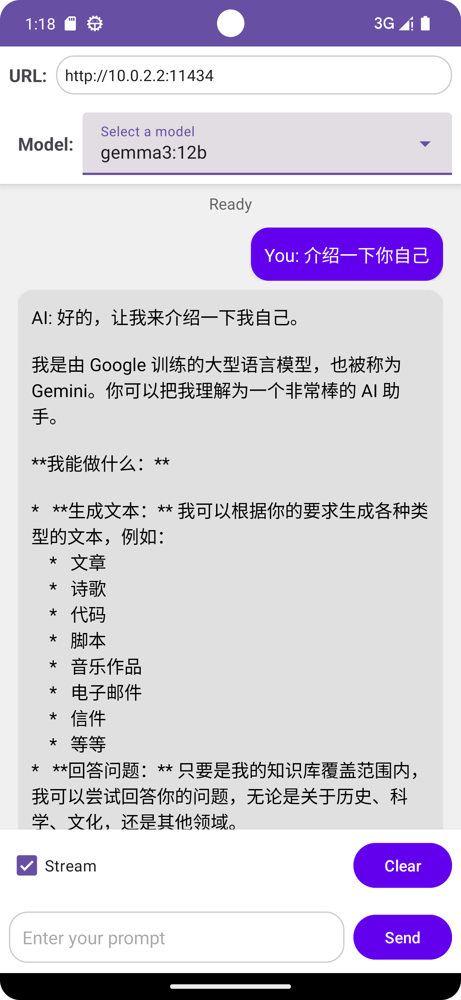
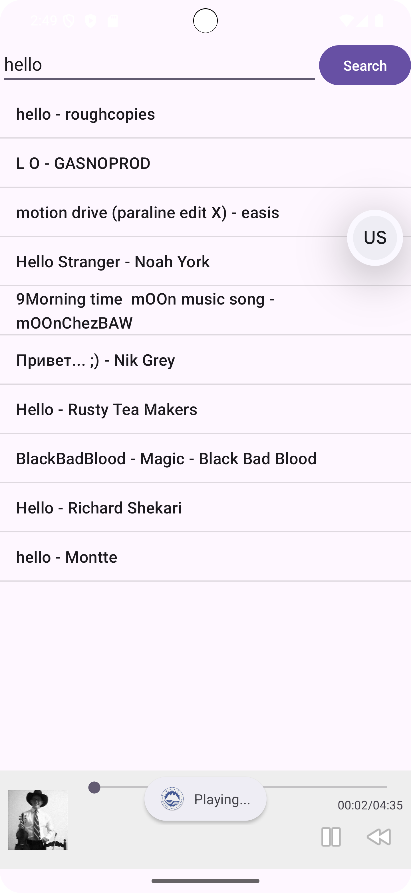

# AIoT 智能家居控制系统
## Android + ESP32 + MQTT + 本地大模型 一体化智能方案

## 项目简介
本项目是基于 Android 客户端开发的 AIoT 智能家居系统，结合 ESP32 嵌入式硬件、MQTT 物联网通信、本地离线大模型（Ollama），实现环境监测、设备远程控制、AI 智能交互、多媒体娱乐等核心功能，是完整的物联网全栈毕业设计/实战项目。

## 核心技术栈
- 移动端：Android、MVVM、MQTT 客户端
- 嵌入式：ESP32、传感器/执行器驱动
- AI 模块：Ollama、DeepSeek-R1、Gemma3
- 通信协议：MQTT、TCP/IP
- 功能：环境监测、远程控制、AI 对话、音乐播放

## 项目截图
### 硬件实物

### Android 主界面
<table>
  <tr>
    <td></td>
    <td></td>
  </tr>
</table>

### AI 大模型交互

### 拓展功能

## 项目亮点
1. 本地离线大模型部署，支持 DeepSeek-R1/Gemma3 热切换
2. 多传感器融合环境监测，实时数据展示
3. MQTT 稳定通信，支持远程设备控制
4. 集成安防报警、多媒体播放等实用功能
5. 全栈开发：Android 客户端 + ESP32 硬件 + 云端通信

## 部署说明
1. 克隆项目到本地
2. 使用 Android Studio 编译运行
3. 配置 ESP32 硬件与 MQTT 服务器
4. 部署 Ollama 服务即可使用 AI 对话功能
